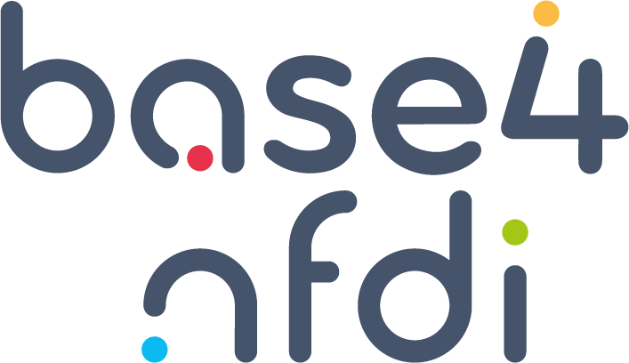

PID4NFDI Cookbook: Getting started with PIDs
===================================

This is a **cookbook** to support you in getting started with PID registration and usage. 
It offers practical guidance on first steps for individuals and organiziations looking to implement PIDs in their workflows. It provides an introduction to what PIDs are, their importance in ensuring long-term access and citation of digital resources, and how they help in maintaining research data, publications, and other digital assets. 

The cookbook is an initiative of the `PID4NFDI project <https://pid.services.base4nfdi.de/>`_ to set up a basic service for Persistent Identifiers (PID) for the member consortia of the German `National Research Data Infrastructure (NFDI) <https://www.nfdi.de/?lang=en>`_ – a joint project of research and infrastructure institutions to optimise research data management within the German research landscape.

The PID4NFDI project is funded as part of `Base4NFDI <https://base4nfdi.de/>`_. DFG Grant number: `521453681 <https://gepris.dfg.de/gepris/projekt/521453681?language=en>`_

.. image:: _static/Logo_DFG_en.jpg
   :alt: Logo DFG
   :height: 40px
   :target: https://www.dfg.de/
   :align: center

.. note::

   This cookbook is work in progress and will continuously grow. 

Contents
--------

.. toctree::
   :caption: Introduction
   :maxdepth: 1

   PID-def
   choose

.. toctree::
   :caption: PID Types / Provider
   :maxdepth: 1

   ark
   doi
   epic
   factgrid
   gnd
   igsn
   orcid
   pida
   pidinst
   ror
   wikidata

.. toctree::
   :caption: Website Information
   :maxdepth: 1

   imprint
   privacy
   accessibility
